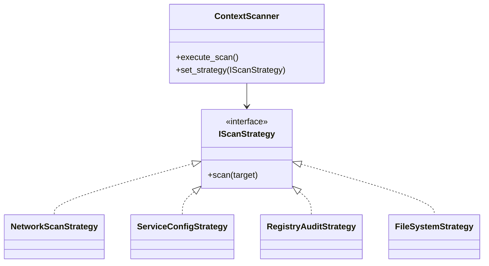

# WinSecDefender 🛡️

**WinSecDefender** es una plataforma integral de **auditoría de seguridad y endurecimiento (hardening)** diseñada específicamente para proteger entornos **Windows Server 2012 R2** y superiores. Utiliza un enfoque híbrido combinando la flexibilidad de **Python**, la potencia nativa de **PowerShell** y la velocidad de bajo nivel de **C#** para identificar y remediar vulnerabilidades críticas.

## 📖 Descripción del Proyecto

Este proyecto nació con el objetivo de automatizar las tareas repetitivas de seguridad en servidores Windows. En lugar de ejecutar múltiples scripts manuales o depender de herramientas costosas, **WinSecDefender** centraliza los chequeos más importantes en una interfaz web moderna y fácil de usar.

El sistema funciona como un orquestador de seguridad que:

1.  **Analiza** la superficie de ataque del servidor (puertos, configuraciones, parches).
2.  **Reporta** los hallazgos con niveles de riesgo claros.
3.  **Remedia** los problemas generando scripts de corrección automáticos.

## 🚀 Características Principales

### 1. � Escaneo de Red y Puertos

Detecta servicios expuestos que podrían ser vectores de ataque:

- **FTP (Puerto 21)**: Verifica si hay transferencias de archivos inseguras.
- **SMB (Puerto 445)**: Identifica recursos compartidos expuestos.
- **RDP (Puerto 3389)**: Detecta acceso remoto abierto.

### 2. ⚙️ Auditoría de Sistema (PowerShell Engine)

Utiliza scripts nativos para inspeccionar configuraciones profundas del sistema operativo:

- **Detección de SMBv1**: Identifica si el protocolo obsoleto y vulnerable (causante de WannaCry) está activo.
- **Unquoted Service Paths**: Busca servicios configurados con rutas sin comillas que permiten escalada de privilegios.
- **Estado de Parches**: Verifica cuál fue la última actualización de seguridad instalada (HotFix).

### 3. 🛡️ Verificación de Integridad (C# Engine)

Un módulo compilado de alto rendimiento para chequeos críticos de registro:

- **Auditoría UAC (User Account Control)**: Verifica que el "Admin Approval Mode" esté habilitado para prevenir cambios no autorizados.
- **Inspección de Registro**: Capaz de auditar cualquier clave del registro de Windows para asegurar cumplimiento de políticas.

### 4. 💊 Auto-Remediación Inteligente

Si se detectan vulnerabilidades, el sistema genera automáticamente un script de PowerShell personalizado (`remediation.ps1`) que:

- Deshabilita SMBv1.
- Corrige las rutas de servicios vulnerables.
- Habilita UAC.
  _Todo listo para ser ejecutado como Administrador._

### 5. 📊 Panel de Control Web

- Interfaz moderna construida con **FastAPI**.
- Visualización de resultados en tiempo real.
- Reportes claros con clasificación de riesgo (ALTO/BAJO).

---

## 🏗️ Arquitectura del Sistema

El proyecto ha sido refactorizado para utilizar el **Patrón Strategy**, permitiendo una arquitectura modular y extensible donde cada motor de escaneo es intercambiable.



### Flujo de Ejecución

1.  **ContextScanner**: Orquesta la ejecución. Puede correr una estrategia específica o todas en conjunto.
2.  **Estrategias**:
    - `NetworkScanStrategy`: Escaneo de puertos asíncrono.
    - `ServiceConfigStrategy`: Auditoría de configuraciones vía PowerShell.
    - `RegistryAuditStrategy`: Inspección de bajo nivel con C#.
    - `FileSystemStrategy`: Verificación de permisos en archivos críticos (ej. `hosts`).

## 🛠️ Instalación y Configuración

### Prerrequisitos

- **Sistema Operativo**: Windows Server 2012 R2 o superior / Windows 10/11.
- **Python**: 3.8 o superior.
- **PowerShell**: Versión 5.1 o superior.
- **.NET Framework**: 4.5+ (Generalmente preinstalado).

### Paso 1: Clonar e Instalar Dependencias

```bash
git clone https://github.com/tu-usuario/win_sec_defender.git
cd win_sec_defender
pip install -r requirements.txt
```

### Paso 2: Compilar Módulos

El componente de C# necesita ser compilado para funcionar. Usa el script de construcción incluido:

```bash
python build.py
```

_Esto generará `RegistryInspector.exe` en la carpeta `bin/`._

### Paso 3: Ejecutar la Aplicación

Inicia el servidor web:

```bash
uvicorn app.main:app --reload
```

O simplemente:

```bash
python -m app.main
```

## 🏃 Guía de Uso

1.  Abre tu navegador y ve a `http://127.0.0.1:8000`.
2.  Verás el panel principal ("Security Dashboard").
3.  Haz clic en **"Run Scan"**. El sistema ejecutará las pruebas en segundo plano (toma unos segundos).
4.  Revisa los resultados en pantalla.
    - Si ves alertas en **Rojo**, son riesgos altos.
5.  Si se encuentran vulnerabilidades, aparecerá el botón **"Generate Fixes"**.
    - Haz clic para descargar o ver el script de remediación generado.
6.  Ejecuta ese script en el servidor con permisos de Administrador para aplicar las correcciones.

### Uso desde Línea de Comandos (CLI)

También es posible ejecutar escaneos específicos desde la terminal sin iniciar el servidor web:

```bash
# Ver ayuda
python -m app.cli --help

# Ejecutar todos los escaneos (por defecto)
python -m app.cli --strategy all

# Ejecutar solo una estrategia específica
python -m app.cli --strategy network   # Escaneo de puertos
python -m app.cli --strategy query     # Auditoría de registro (Registry)
python -m app.cli --strategy service   # Configuración de servicios
python -m app.cli --strategy file      # Permisos de archivos
```

---

## 📂 Estructura del Proyecto

- `app/`: Código fuente de la aplicación principal.
  - `main.py`: Punto de entrada de FastAPI.
  - `core/`: Lógica de negocio (Scanner).
  - `api/`: Endpoints de la API REST.
- `scripts/`: Scripts auxiliares que ejecuta el motor.
  - `audit_script.ps1`: Lógica de auditoría de Windows.
  - `RegistryInspector.cs`: Código fuente del inspector de registro.
- `bin/`: Binarios compilados (se llena tras ejecutar `build.py`).
- `reports/`: Almacenamiento de reportes generados.

## ⚠️ Nota de Responsabilidad

Esta herramienta realiza cambios en configuraciones del sistema (si se ejecutan los scripts de remediación). Úsala bajo tu propia responsabilidad. Se recomienda probar siempre en un entorno de desarrollo antes de aplicar en producción.

## ⚖️ Aviso Legal

**WinSecDefender** es una herramienta educativa y de administración de sistemas. Su propósito es ayudar a los administradores a asegurar sus propios sistemas.

- El uso de esta herramienta contra sistemas que no son de tu propiedad o sin autorización explícita **es ilegal**.
- Los desarrolladores no se hacen responsables del mal uso de este software ni de los daños que pueda causar.

## 📄 Licencia

Este proyecto está bajo la Licencia MIT. Consulta el archivo `LICENSE` para más detalles.

```text
MIT License

Copyright (c) 2025 [Tu Nombre Completo]

Permission is hereby granted, free of charge, to any person obtaining a copy
of this software and associated documentation files (the "Software"), to deal
in the Software without restriction, including without limitation the rights
to use, copy, modify, merge, publish, distribute, sublicense, and/or sell
copies of the Software, and to permit persons to whom the Software is
furnished to do so, subject to the following conditions:

The above copyright notice and this permission notice shall be included in all
copies or substantial portions of the Software.

THE SOFTWARE IS PROVIDED "AS IS", WITHOUT WARRANTY OF ANY KIND, EXPRESS OR
IMPLIED, INCLUDING BUT NOT LIMITED TO THE WARRANTIES OF MERCHANTABILITY,
FITNESS FOR A PARTICULAR PURPOSE AND NONINFRINGEMENT. IN NO EVENT SHALL THE
AUTHORS OR COPYRIGHT HOLDERS BE LIABLE FOR ANY CLAIM, DAMAGES OR OTHER
LIABILITY, WHETHER IN AN ACTION OF CONTRACT, TORT OR OTHERWISE, ARISING FROM,
OUT OF OR IN CONNECTION WITH THE SOFTWARE OR THE USE OR OTHER DEALINGS IN THE
SOFTWARE.
```
